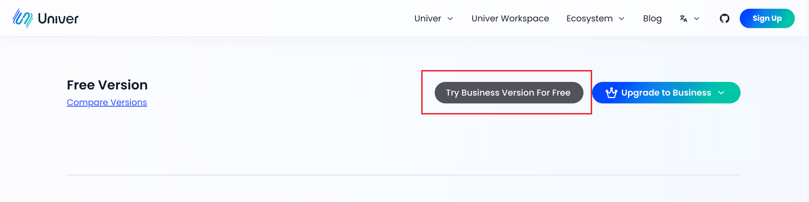
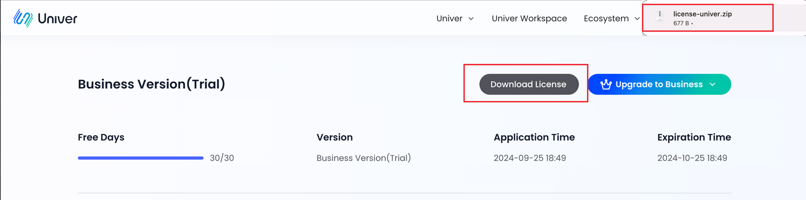
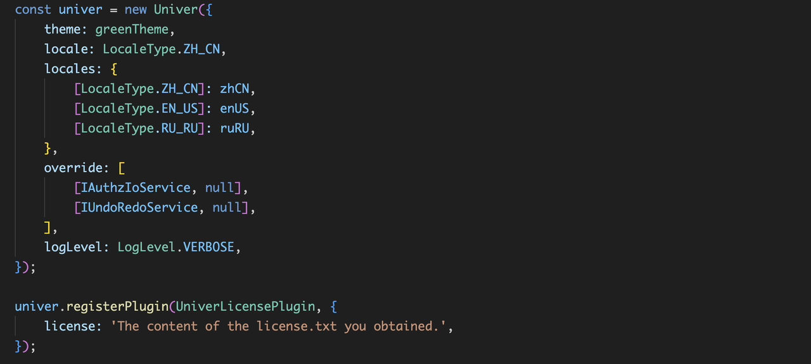
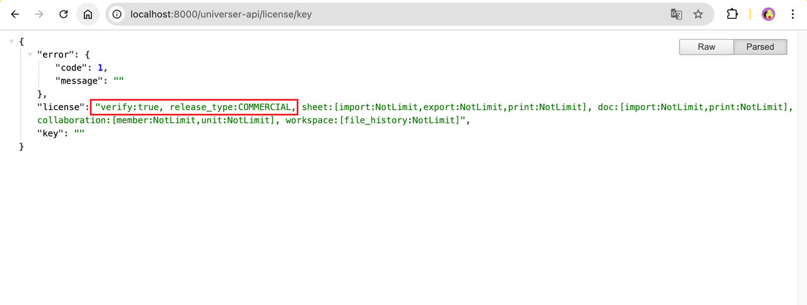

# License

## Introduction

## Obtain a License
Click [this page](https://univer.ai/zh-CN/pro/license) to obtain the license file.





## Use a License
unzipping the downloaded `license-univer.zip` file, you will get `license.txt` and `licenseKey.txt` files. Please keep these two files safe and ensure that you do not modify their format or content.

### Use License in JavaScript/TypeScript Projects

1. In addition to importing the univer plugin in your project, also import the license plugin. For specific plugin import methods, please refer to [here](https://univer.ai/guides/sheet/getting-started/installation#usage).

```TypeScript
import { UniverLicensePlugin } from '@univerjs-pro/license';
```

2. Register the `UniverLicensePlugin` plugin. Make sure this plugin is registered first after the univer instance is initialized, as shown in the image below. Then paste the content of the `license.txt` file into the license parameter of the plugin.

```TypeScript
univer.registerPlugin(UniverLicensePlugin, {
    license: `Content of your license.txt file`
});
```



### Use License with Univer Server

- Use docker-compose

Copy the `license.txt` and `licenseKey.txt` files to the `/docker-compose/configs/` directory.
Run the service script `bash run.sh` in the docker-compose directory to restart the universer service.

- Use Kubernetes

execute
```shell
helm upgrade --install -n univer --create-namespace \
    --set global.istioNamespace="univer" \
    --set-file universer.license.licenseV2=$(YOUR_LICENSE_TXT_PATH) \
    --set-file universer.license.licenseKeyV2=$(YOUR_LICENSE_KEY_TXT_PATH) \
    univer-stack oci://univer-acr-registry.cn-shenzhen.cr.aliyuncs.com/helm-charts/univer-stack
```

## Verifying the License File

After successfully replacing the frontend and backend license files and restarting the service, please follow these steps to verify that the service is running normally and the license has been successfully loaded.

### Univer Server
1. Visit `host:8000/universer-api/license/key` to view the license entitlement information.
For example: If your service is running locally, please visit `http://localhost:8000/universer-api/license/key`.

```json
{
"verify":true // License verification result
"release_type":"COMMERCIAL" // License type
}

```



### JavaScript/TypeScript
1. After injecting the License into the frontend and starting the project, you can verify whether the License is valid and being used correctly.
Note: If no license is entered, or if the entered license is invalid (e.g., expired or incorrect content), some features will be restricted, and a watermark will be displayed on the page.


2. With a valid license entered, the project will run normally without restrictions.
