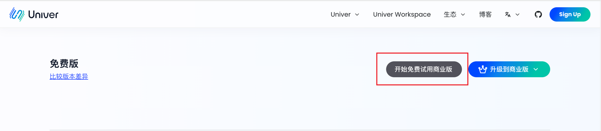
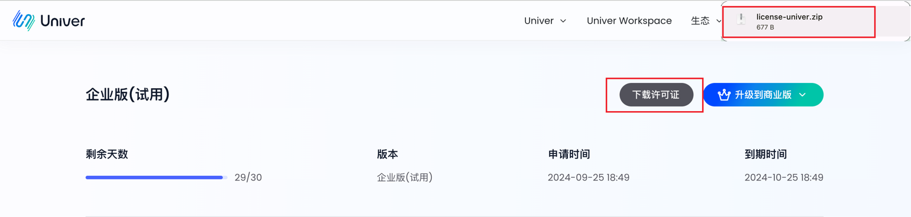

# 许可证

## 概述

## 获取许可证
[点击页面](https://univer.ai/zh-CN/pro/license)登录获取许可证文件



## 使用许可证
解压下载好的许可证文件 `license-univer.zip` ，您将获得 `license.txt` 和 `licenseKey.txt` 文件。请妥善保管这两个文件，并确保不要修改其格式和内容。

### 在 JavaScript/TypeScript 项目中使用许可证
1. 在项目中引入 univer 插件的地方额外引入 license 插件，具体的插件引入方式请参考[这里](https://univer.ai/guides/sheet/getting-started/installation#usage)。

```TypeScript
import { UniverLicensePlugin } from '@univerjs-pro/license';
```

2. 注册 `UniverLicensePlugin` 插件，这里要保证该插件的顺序在 univer 实例化之后最先注册。然后将获得 `license.txt` 中的内容粘贴到插件的 license 参数中。

```TypeScript
univer.registerPlugin(UniverLicensePlugin, {
    license: `您获得的license.txt中的内容`
});
```

### 在 Univer Server 中使用许可证

- 使用docker-compose

将 `license.txt` 和 `licenseKey.txt` 文件拷贝到 `/docker-compose/configs/` 目录中。 在docker-compose目录下运行服务脚本 `bash run.sh` 重启universer服务。

- 使用Kubernetest

执行

```
helm upgrade --install -n univer --create-namespace \
    --set global.istioNamespace="univer" \
    --set-file universer.license.licenseV2=$(YOUR_LICENSE_TXT_PATH) \
    --set-file universer.license.licenseKeyV2=$(YOUR_LICENSE_KEY_TXT_PATH) \
    univer-stack oci://univer-acr-registry.cn-shenzhen.cr.aliyuncs.com/helm-charts/univer-stack
```

## 验证许可证

### Univer Server

1. 访问 `host:8000/universer-api/license/key` 查看许可证权益信息。 例如：若您的服务在本地运行请访问 `http://localhost:8000/universer-api/license/key `。

```json
{
"verify":"true", // 许可证验证结果
"release_type":"COMMERCIAL" // 许可证类型
}
```


### JavaScript/TypeScript
1. 前端将 License 注入后 启动项目后即可验证 License 是否合法以及是否被正确使用。
注：如果未输入许可证，或输入的许可证不合法（例如过期或内容错误），部分功能将受到限制，并且页面上会显示水印。


2. 在输入合法许可证的情况下，项目将正常运行，且不会受到限制。
