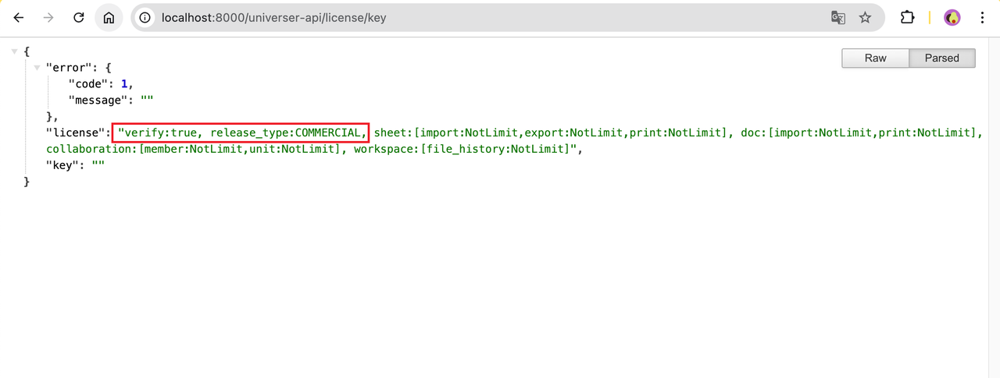

import { Cards, Callout, Steps, Tabs } from 'nextra/components'

# 许可证

## 概述

完整的 Univer 高级功能需要许可证的支持，你可以通过添加许可证到你的项目中来激活付费计划，或者你可以通过更新你的许可证来升级到更高级别的计划。此页面将指导你如何获取、配置和验证许可证。

## 先决条件
在开始之前，请确保你：
- 在你的项目中集成 Univer 高级功能。如果你还未完成集成，请参考[集成 Univer 高级功能](/guides/sheets/getting-started/quickstart#integration-advanced-features)。
- 对于服务端部署，已完成 Docker 或 Kubernetes 环境的配置。如果你尚未完成配置，请参考 [Docker 部署文档](/guides/sheets/pro-features/server/docker) 或 [Kubernetes 部署文档](/guides/sheets/pro-features/server/kubernetes)。
- 拥有有效的许可证。如果你还没有，可以在通过在[许可证页面](https://univer.ai/pro/license)上注册来获取。

## 下载许可证
1. 访问[许可证页面](https://univer.ai/zh-CN/pro/license)并登录你的账号

2. 下载许可证文件


### 免费申请试用许可证

如果你没有许可证或者还在犹豫是否购买，我们为你准备了一个 30 天的试用许可证，以便于你能完整体验 Univer 的所有高级功能。

1. 访问[许可证页面](https://univer.ai/zh-CN/pro/license)并登录你的账号

2. 点击“获取试用许可证”按钮


## 添加或更新许可证

解压下载好的许可证文件 `license-univer.zip` ，你将获得 `license.txt` 和 `licenseKey.txt` 文件。请妥善保管这两个文件，并确保不要修改其格式和内容。

### 在 JavaScript/TypeScript 项目中使用许可证
1. 在项目中引入 univer 插件的地方额外引入 license 插件，具体的插件引入方式请参考[这里](https://univer.ai/guides/sheet/getting-started/installation#usage)。

```typescript
import { UniverLicensePlugin } from '@univerjs-pro/license';
```

2. 注册 `UniverLicensePlugin` 插件，这里要保证该插件的顺序在 univer 实例化之后最先注册。然后将获得 `license.txt` 中的内容粘贴到插件的 license 参数中。

```typescript {2-4}
const univer = new Univer(/** 省略 */);
univer.registerPlugin(UniverLicensePlugin, {
    license: `你获得的license.txt中的内容`
});
```

### 在 Univer Server 中使用许可证

<Tabs items={['docker-compose', 'Kubernetest']}>
    <Tabs.Tab>
        1. 将 `license.txt` 和 `licenseKey.txt` 文件拷贝到 `/docker-compose/configs/` 目录中。 
        2. 在 docker-compose 目录下运行服务脚本 `bash run.sh` 重启universer服务。
    </Tabs.Tab>
    <Tabs.Tab>
        1. 执行以下命令
```bash
helm upgrade --install -n univer --create-namespace \
--set global.istioNamespace="univer" \
--set-file universer.license.licenseV2=$(YOUR_LICENSE_TXT_PATH) \
--set-file universer.license.licenseKeyV2=$(YOUR_LICENSE_KEY_TXT_PATH) \
univer-stack oci://univer-acr-registry.cn-shenzhen.cr.aliyuncs.com/helm-charts/univer-stack
```
    </Tabs.Tab>
</Tabs>

## 验证许可证

### 验证 JavaScript/TypeScript 项目中的许可证
1. 前端将 License 注入后 启动项目后即可验证 License 是否合法以及是否被正确使用。
注：如果未输入许可证，或输入的许可证不合法（例如过期或内容错误），部分功能将受到限制，并且页面上会显示水印。


2. 在输入合法许可证的情况下，项目将正常运行，且不会受到限制。


### 验证 Univer Server 中的许可证

1. 访问 `host:8000/universer-api/license/key` 查看许可证权益信息。 例如：若你的服务在本地运行请访问 `http://localhost:8000/universer-api/license/key `。

```json
{
    "verify":"true", // 许可证验证结果
    "release_type":"COMMERCIAL" // 许可证类型
}
```


## 常见问题

1. 如果许可证验证失败，请检查：
   - 许可证文件是否完整且未被修改
   - 许可证是否过期
   - 服务是否正确重启
2. 如遇到其他问题，请联系我们的技术支持

## 相关链接
- [集成 Univer 高级功能](/guides/sheets/getting-started/quickstart#integration-advanced-features)
- [Docker 部署文档](/guides/sheets/pro-features/server/docker)
- [Kubernetes 部署文档](/guides/sheets/pro-features/server/kubernetes)
