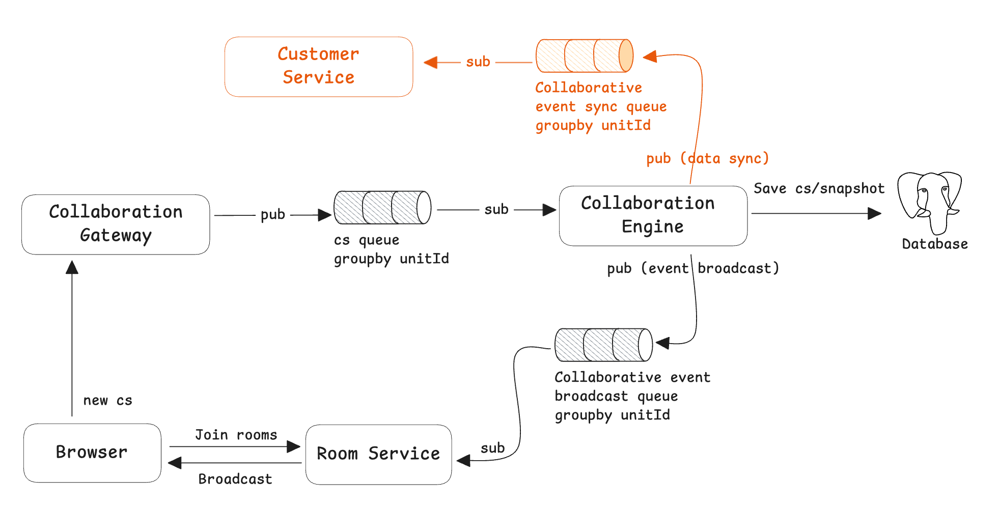

# Event synchronization mechanism

The event synchronization mechanism provides a channel for publishing events that occur within the collaborative engine. The client system can consume these events and combine them with its own business to take the next step.



**How to use event synchronization mechanism?**

Currently supported for collaborative event synchronization:

- Collaborative editing: changeset successfully stored

## How to use event synchronization mechanism

Starting to use the event synchronization mechanism is very simple.

1. Turn on event synchronization switch
2. Initiate Consumer Event

### Turn on event synchronization switch

Go to `docker-compose` directory, edit the `.env` file, find and set `EVENT_SYNC` to true:

```yaml
EVENT_SYNC=true
```

Run the following command to restart the service:

```go
bash run.sh
```

### Code Snippet for consumer

Refer to [https://github.com/dream-num/univer-event-sync-example-go](https://github.com/dream-num/univer-event-sync-example-go)

## Data structures

```go
message EventSyncData {
  string eventId = 1;
  string eventType = 2; // type of event, now support changeset
  int32 createdAt = 3;
  oneof event {
    univer.ChangesetAck csAckEvent = 4;
    // more event types in the future.
  }
}

message ChangesetAck {
    univer.Changeset cs = 1;
}

message Changeset {
    string unitID = 1; // unitID of the Univer document
    univer.constants.UniverType type = 2;
    int32 baseRev = 3;
    int32 revision = 4;
    string userID = 5;
    repeated Mutation mutations = 6;
    string memberID = 7;
}

message Mutation {
    string id = 1; // ID of the mutation
    string data = 2; // serialized params
}
```