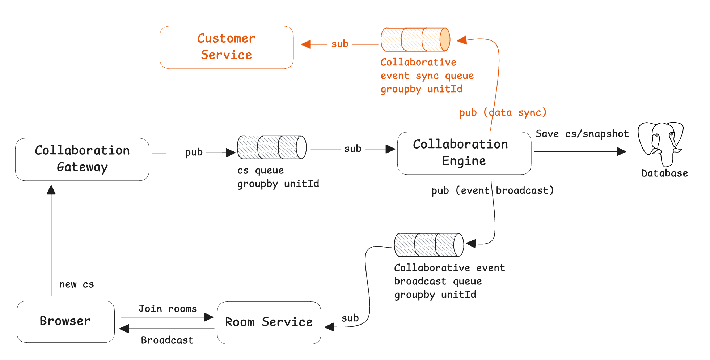

# 事件同步机制

事件同步机制提供一种将协同引擎内部发生事件发布出去的通道，客户系统能够消费这些事件，结合自身的业务做下一步事情。



**事件同步了哪些内容？**

目前协同事件同步支持：

- 协同编辑：成功落库的 changeset

## 如何使用事件同步机制

开始使用事件同步机制非常简单：

1. 开启事件同步开关
2. 启动 Consumer 消费事件

### 开启事件同步开关

进入 `docker-compose` 目录，修改`.env` 配置文件，找到`EVENT_SYNC`配置设置为`true`

```yaml
EVENT_SYNC=true
```

运行以下命令，重启服务：

```go
bash run.sh
```

### 消费者代码示例

参考 [https://github.com/dream-num/univer-event-sync-example-go](https://github.com/dream-num/univer-event-sync-example-go)

## 关键的数据结构

```go
message EventSyncData {
  string eventId = 1;
  string eventType = 2; // type of event, now support changeset
  int32 createdAt = 3;
  oneof event {
    univer.ChangesetAck csAckEvent = 4;
    // more event types in the future.
  }
}

message ChangesetAck {
    univer.Changeset cs = 1;
}

message Changeset {
    string unitID = 1; // unitID of the Univer document
    univer.constants.UniverType type = 2;
    int32 baseRev = 3;
    int32 revision = 4;
    string userID = 5;
    repeated Mutation mutations = 6;
    string memberID = 7;
}

message Mutation {
    string id = 1; // ID of the mutation
    string data = 2; // serialized params
}
```